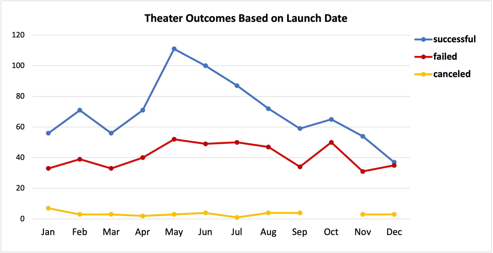
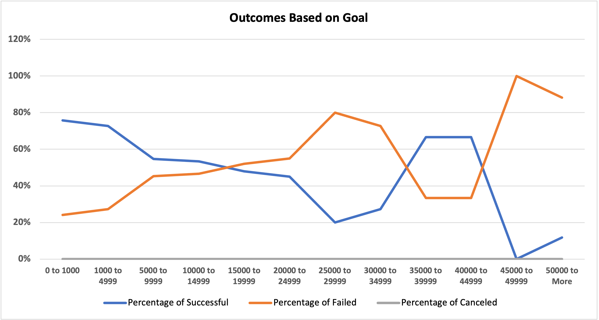

[Week-1](../readme.md)

# Kickstarting with Excel

## Project Overview

In this project we will analyze a dataset of [Kickstarter](https://en.wikipedia.org/wiki/Kickstarter) campaigns dating from 2009 to 2017. We will use the campaign's launch month and its monetary goal as our main criteria and filter the data in order to find the most succesful ones on a specific category. Finally we will display the most useful parameters in two easy-to-read charts to serve as a guide in our future campaign strategy.


### Purpose

Our goal is to create an strategy for launching a Kickstarter campaign under the [theater plays](https://en.wikipedia.org/wiki/Play_(theatre)) category with a high chance of success. There are a lot of projects that fail or are canceled midway for multiple reasons and we want to have a general notion of where those projects are situated in the distribution, if they follow a trend or not. We also want to find the higher concentration of both failed and successful campaigns to get an accurate representation of our success rate.


## Analysis and Challenges

The data contains a lot of mixed campaign categories and information we are not interested in for this particular analysis, so the first step is to filter the data.

As a first filter criteria, our client specified:
```
outcome of theater campaigns based on launch date
```

### Analysis of Outcomes Based on Launch Date

Using Excel's Pivot Tables we can get the total amount of outcomes, then display them by launch date but only keeping the month part of it. This means that all datapoints with January as their launch date month will be included regardless of their year or day. Finally, we can filter by theater category and sort the columns from successful to canceled.



As a reference, here is the total amount of outcomes regardless of launch date.
|	Successful	|Failed|   Canceled|	Total|
|-----|---|-----|-----|
|	839	|493|   37|	1369|

**Conclusion:** Our best chance seems to be launching the campaign in the month of May, although we still more information about what constitutes a successful campaign.

Our next step is to filter the campaigns by:

```
outcome of plays based on their monetary goals
```

### Analysis of Outcomes Based on Goals

In order to gain more insight on the successful campaigns and discard outliers from our dataset, we need to filter our data **and then** get a few parameters that will help improve our analysis

With Excel formulas, we can find only the cells we are interested using:
```
COUNTIFS(criteria, range, ...)
```
Which helps us create a brand new table of campaign outcomes and their goals. For example, the first four rows and four cells look like this:

|   |	A	|B|   C|	D|
|----|-----|---|-----|-----|
| 1  |	**Goal**	|**Successful**|   **Failed**|	**Canceled**|
| 2  |	0 to 1000	|141|   45|	0|
| 3  |	1000 to 4999	|386|   143|	1|
| 4  | 5000 to 10000 |91	|79	|0|
|...|...|...|...|...|
| 14 | 50000 to More |	2	|23	|9 |

We can gather the information for the whole dataset with this formula:

```excel
=COUNTIFS(
    Kickstarter!$R2:$R4115, "=plays",
    Kickstarter!$F$2:$F$4115, "=" &B$15,
    Kickstarter!$D$2:$D$4115,">="&$I2,
    Kickstarter!$D$2:$D$4115,"<"&$I3
)
```
Which in this case is the formula for cell B2 but it translates to:

```
Find all rows that meet this condition:

- The Sub Category is "plays".
- The Outcome is equal to a specific cell, in this case "Successful, "Failed" or "Canceled".
- The Goal is higher or equal to a specific cell.
- The Goal is lesser than another specific cell.
```

Steps 3 and 4 can be represented with the following column of lower and upper limits:
|   |   I|
|----|----|
|  1 |  **Limits** |
|  2 |  0 |
|  3 |  1000 |
|  4 |  5000 |
| ... | ...|
| 14 | 1E+99 |

With this information we can get the total and percentages of each range of goals and their outcomes:

| 1  |	**Goal**	|...|**Total** | **Successful**| **Failed** | **Canceled** |
|----|-----|---|----|----|----|----|
| 2  |	0 to 1000	|...|186 | 76% | 24% |	0%  |
| 3  |	1000 to 4999|...|530 |  73%	|27%	|0% |
| 4  | 5000 to 10000|...|170 | 54%	|46%	|0% |
|...|...|...|...| ...| ...| ...|
| 14 | 50000 to More |...| 34 | 6%|	68%	 |26% |

And finally we generate a chart with using the percentage data.



**Conclusion:** Most projects with exceedingly high goals do not succeed, as expected. And although we see a great ratio around the range of 35,000 to 50,000, the population is too small to use it as a good statistic.

### Challenges and Difficulties Encountered

## Results

- What are two conclusions you can draw about the Outcomes based on Launch Date?

- What can you conclude about the Outcomes based on Goals?

- What are some limitations of this dataset?

- What are some other possible tables and/or graphs that we could create?
