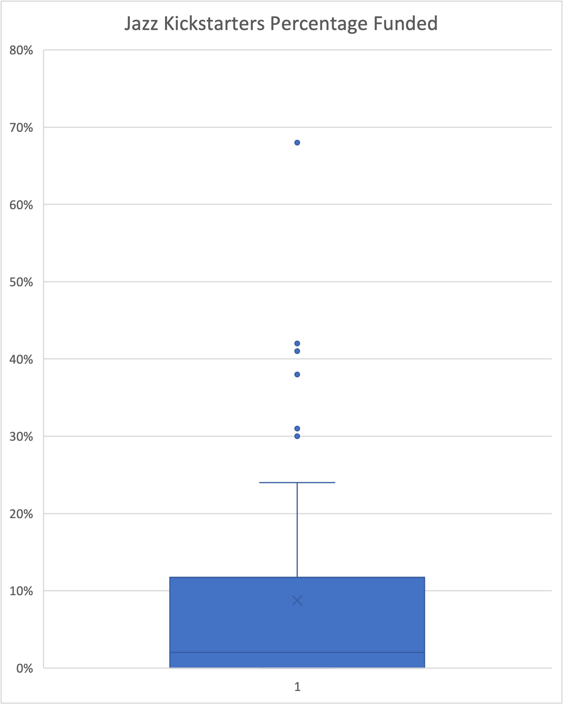
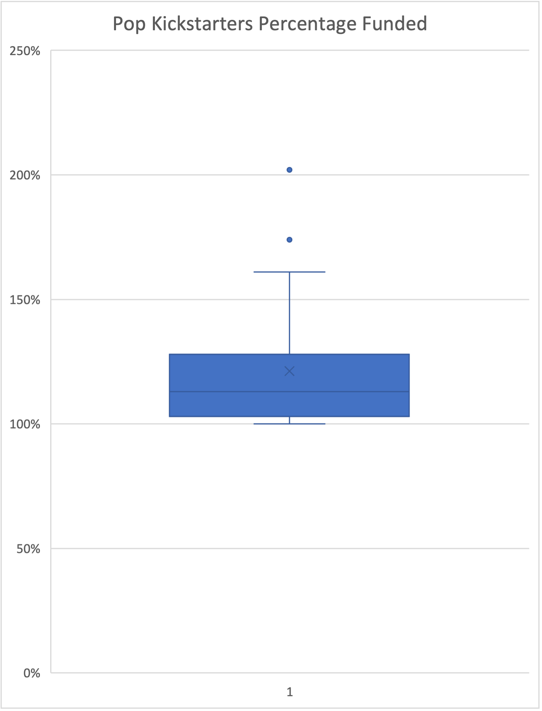

[Week-1](../readme.md)

# Kickstarter

## Category Statistics:

The following chart represents the data filtered by Parent Category in any country. We can see that the theater category has the highest amount of successful Kickstarters although not the highest Successful to Failed/Canceled campaigns ratio. 

## SubCategory Statistics

The following chart shows all the Sub Categories of all Parent Categories, giving us a better understanding on what kind of projects are more likely to succeed. For example, all Animation, Food Trucks, Dramas and Jazz projects seem to have never succeeded, to name a few.

## Launch Date Outcome Statistics

The following line chart helps us find the better Launch Dates to start a Kickstarter campaign.

## Musicals in Great Britain, Goals and Pledges

Finally, we can use a Box and Whiskers plot to find that the average goal for the Musicals in Great Britain was about $4,000 GBP with outliers up to about $15,000 GBP. And a upper bound of around $10,000 GBP.

That is all for the required material but I decided to take a deeper dive on the Kickstarter campaigns under ther Parent Category of Music.

# Music Sub Categories (Extra Exercise)

The sheet name is [Kickstarter_5plus.xlsx](./Kickstarter_5plus.xlsx)

Doing a bit of digging on the Music SubCategories, we can find a few cases where some sub categories completely failed compared to other sub categories that always succeeded.

The following charts show a few outliers on the jazz Sub Category population.

Just for sake of comparison, here is the Pop sub category plot where most project passed the goal by above 110 percent.

Finally, the percentage of success of the various music genres:

This concludes this week's material.